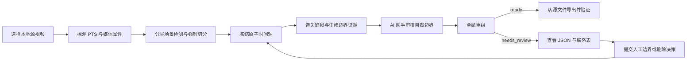

# TikTok 短视频复刻 Phase 1 PRD

## 文档信息

| 项目 | 内容 |
| --- | --- |
| 产品能力 | 复刻素材预处理：切分、关键帧、重组与导出 |
| 版本 | 004（SceneDetect + Agent 审核稿） |
| 状态 | 已批准实施 |
| 上游需求 | [`../raw/tiktok-short-video-replication-requirements-001.md`](../raw/tiktok-short-video-replication-requirements-001.md) |
| 当前交付 | PRD、技术设计与 Phase 1 预处理实现 |

## 1. 评估结论

原始需求的业务方向成立，但时间单位、长片段定义、短片段兜底、相似度实现、音频导出和结果状态存在实现歧义。本稿将 Phase 1 收敛为一个可独立注册、未来可被完整复刻流水线调用的确定性预处理能力。

关键调整如下：

- 以整数 PTS 和有理数 `time_base` 作为唯一权威时间表示，秒数仅用于展示。
- 将“原子片段”定义为分层检测策略保留的连续区间，不承诺穷尽物理镜头。
- 使用可配置的生成模型时长档案；默认要求 `3.2s <= duration < 15s`，规划安全上限为 `14.8s`。
- 不自动借用相邻区间、不静默删除、不透传非法片段；无合法全局方案时进入 `needs_review` 并阻断视频片段导出。
- 不嵌入视觉模型；SceneDetect 边界强度提供可审计证据，场景语义由 AI 编程助手查看联系表后提交结构化判断。
- 导出的每个生成片段保留其源时间区间内的音频内容；本阶段不完成最终拼接或混音。

## 2. 目标与范围

### 2.1 产品目标

对一个本地商品短视频生成可追溯、可复核、可供后续场景替换和片段生成消费的预处理包：

1. 识别并细化镜头边界，使原子片段严格短于生成档案上限；
2. 为每个原子片段选出一张靠近起点的清晰关键帧；
3. 仅在相邻区间内执行全局重组，产出合法生成片段；
4. 保留源时间轴、内部切换锚点、音频区间和人工干预记录；
5. 在导出前暴露不可自动解决的问题，避免生成不可追溯的媒体结果。

### 2.2 输入边界

首版仅接受本地、可 seek、可由 FFmpeg/PyAV 解码的 SDR 视频文件。选择单个主视频流和一个默认音频流；无音频时允许继续并记录 `audio_present=false`。不支持 TikTok URL 下载、DRM/加密媒体、HDR 色彩管理和多视频流编排。

### 2.3 不在范围内

- 场景或人物替换、视频生成模型调用；
- ASR、字幕或叙事语义边界识别；
- 最终视频拼接、全片音频重排、混音和发布；
- Backlot UI 改造、现有流水线改造或新流水线创建；
- 对场景分组、关键帧质量或复刻效果给出准确率承诺。

## 3. 核心产品契约

### 3.1 时间与区间

- 时间点表示为 `{pts, time_base: {num, den}, seconds}`，其中 `seconds = pts * num / den` 仅为派生值。
- 所有区间采用半开语义 `[start_pts, end_pts)`，时长以精确有理数差计算。
- 原子片段按源时间连续、无重叠排列。除经人工明确批准的删除区间外，时间轴不得有空洞。

### 3.2 原子片段与生成片段

- **原子片段（Atomic Segment）**：由本需求规定的分层检测或强制切点形成、被系统保留的最小连续区间。
- **生成片段（Generation Clip）**：由 1～3 个相邻原子片段组成，满足当前生成档案的全部约束。
- **硬边界（Hard Boundary）**：自动判断或人工指定、禁止自动跨越重组的边界。
- **场景组（Scene Group）**：由 Agent 确认的 `same_scene` 软边界串联形成的环境相似区间，不等同于叙事语义场景。

### 3.3 状态与导出门禁

计划状态只有 `ready`、`needs_review`、`blocked`：

- `ready`：时间轴存在完整合法解，可导出生成片段；
- `needs_review`：分析完成但没有合法解，输出清单和联系表，不导出任何生成片段；
- `blocked`：媒体依赖、输入能力或源文件不满足要求，不能形成有效计划。

源视频致命解码错误直接使工具失败，不以部分成功结果掩盖。人工覆盖必须产生新的计划修订版，并使受影响的下游文件失效。

## 4. 用户流程

## 5. 功能需求

### FR-001 视频读取与元数据

读取容器、主视频流、默认音频流、编码、分辨率、旋转、平均帧率、真实时间基、首尾 PTS、VFR 判断与解码异常。所有切点和持续时间必须基于原生 PTS；输入还需记录文件 SHA-256。

### FR-002 初次场景检测

必须使用 PySceneDetect 的 PyAV 后端。以 `threshold=50`、`min_scene_len_frames=12` 在完整视频上形成首轮候选边界，同时保留每帧 `content_val`、阈值、PTS 和边界来源；此阶段不得切视频文件。

### FR-003 长片段递归细分

对仍达到生成档案上限的区间，依次模拟阈值 `45, 40, 35, 30, 25, 20`。每轮只接受当前长区间内的边界，并优先选择端点余量合法、分数更强、切分更均衡、PTS 更早的候选。低阈值候选即使未采用，也须保留为诊断信息。

### FR-004 无自然切点时强制切分

最低阈值仍无法解决时，在距当前区间起点 8～12 秒范围内选择曝光正常、清晰、稳定且低运动的帧；规划目标不超过 14.8 秒。边界标记为 `forced`。重复处理直到每个原子片段严格小于当前档案上限。

### FR-005 清晰近首帧提取

在 `[segment_start, min(start+1s, start+30%*duration)]` 内逐帧评估清晰度、曝光、黑白像素比例、稳定性和距起点偏移。选择最早通过门槛的帧；无通过项时选择确定性综合分最高者并标记 `low_quality_fallback`。保存关键帧 PTS、片段内偏移和指标。

### FR-006 边界证据与 Agent 场景判别

系统只为已采用的相邻原子片段自然边界生成审核项。每项必须包含 SceneDetect `content_val`、HSV 分量、检测阈值、精确 PTS，以及左右关键帧、边界前后约 500ms 上下文帧、边界两侧最近解码帧和中心遮罩背景视图。`content_val` 只表示像素变化强度，不得直接解释为语义相似度或硬边界概率。

AI 编程助手查看证据后必须提交 `same_scene`、`different_scene` 或 `uncertain`，并附置信度、证据引用和可观察理由。`same_scene` 映射为软边界，`different_scene` 映射为硬边界，`uncertain` 禁止自动跨越。最多两轮 Agent 审核；第二轮扩展至约 ±1.5 秒上下文，仍不确定则进入人工检查。Python 工具不得调用 LLM 或依赖模型权重。

### FR-007 全局片段重组

使用动态规划或等价 DAG 最短路径算法。自动方案必须同时满足：

- 只组合相邻原子片段且不改变顺序；
- 每个生成片段包含 1～3 个原子片段；
- 满足生成档案时长，默认 `3.2s <= duration < 15s`；
- 自动组合内至多有一个时长不小于 3.2 秒的原子片段；
- 不主动合并两个已独立合规的原子片段；
- 不跨硬边界，也不移动已冻结的原子边界。

合法方案按“删除总时长、删除数量、所跨软边界 `content_val` 总和、合并次数、确定性顺序”进行字典序最小化。

### FR-008 孤立短片段处理

先通过全局重组尝试吸收短片段。自动规划不得借用相邻长片段的部分时长，也不得跨硬边界。`1s <= duration < 3.2s` 的未解决片段只能进入 `needs_review`。小于 1 秒的片段默认同样进入人工检查；只有同时启用 `allow_drop_under_1s` 且人工提交 `drop` 决策后才可删除，并记录原因及同步音频区间。

### FR-009 关键帧绑定

生成片段按顺序保留全部成员原子片段 ID 和关键帧路径。第一张为主起始关键帧，其余关键帧附带相对生成片段起点的内部切换 PTS；不得用关键帧复用伪造跨片段连续性。

### FR-010 一次性媒体导出

仅当计划为 `ready` 时，直接按源 PTS 从原始视频导出每个生成片段，不把中间片段作为下一轮输入。导出采用精确重编码并保留相同源区间的音频内容；无音频源则输出无声片段并记录。每个文件必须完整解码和复测时长，失败或越界时使该计划失效并重新规划或转人工，不得静默裁短形成时间洞。

### FR-011 标准化结果清单

输出源媒体、边界、原子片段、相邻关系、生成片段、删除区间、时间轴映射、质量报告、人工检查项，以及带哈希的规范索引。文件必须位于 `projects/<project-id>/` 的标准目录中；关键帧和联系表位于 `assets/images/`，生成片段位于 `assets/video/`。

## 6. 默认策略与人工覆盖

默认生成档案为：最小时长 3.2 秒、最大时长 15 秒且上限排除、强制切分规划上限 14.8 秒、每片最多 3 个原子片段。档案是版本化配置，可为未来生成模型增加其他约束而不改变时间轴语义。

系统自动识别持续至少 80ms、两侧恢复正常画面的黑/白场或明确淡变并标记为硬边界；单帧闪光不得自动判硬。为时长限制插入的强制切点默认属于同场景软边界。其余自然边界由 Agent 判别。审核者可按边界 ID 提交 `force_hard`、`force_soft`、`insert_boundary` 或 `remove_boundary`；对小于 1 秒的区间还可在配置允许时提交 `drop`。人工覆盖优先级最高，并必须包含操作者、理由、父修订版和配置指纹。

## 7. 输出与审核体验

首版审核面为结构化 JSON 与一张带时间戳、片段 ID、边界类型和质量徽标的联系表，不修改 Backlot。`needs_review` 仍须产出关键帧、联系表、候选处理建议和完整诊断，但 `assets/video/replication/clips/` 下不得出现生成片段。

每个稳定 ID 由源文件 SHA-256、PTS 区间、配置版本和工具指纹派生；展示序号独立保存，不能参与身份计算。审核提交哈希影响计划与生成片段 ID，但不改变原子片段 ID。所有媒体文件与规范清单均记录 SHA-256。

## 8. 验收标准

1. 所有 `ready` 生成片段符合档案时长、成员数量、顺序和硬边界约束。
2. VFR、非零起始 PTS 和旋转视频的边界、关键帧、音频及导出片段无累计时间漂移。
3. 除人工批准的 `dropped_intervals` 外，原子片段完整覆盖源时间轴，且无重叠、重复或空洞。
4. 每个原子片段都有关键帧或明确的 `failed` 记录；降级关键帧携带全部质量指标。
5. 无合法全局解时状态为 `needs_review`，有审核材料但无生成片段文件。
6. 缺失 PyAV、PySceneDetect 或 FFmpeg 时状态为 `blocked`；未安装 Torch/Transformers、无 GPU、无模型缓存均不得影响可用性。
7. 导出文件可完整解码，实测时长合法，音频存在性与源文件相符，清单路径和哈希一致。
8. 相同源文件、配置、工具版本和同一审核提交产生相同计划与稳定 ID；不要求不同 AI 助手独立判断相同，也不要求跨 FFmpeg 版本生成字节完全一致的媒体。
9. 清晰度和 SceneDetect 阈值可配置并在报告中回显。首版验收只检查算法、证据和状态契约，不以场景判别准确率为发布门槛。

## 9. 核心验收样例

| 输入条件 | 预期结果 |
| --- | --- |
| `3.3s, 4.1s` | 保持两个独立生成片段 |
| `1.4s, 2.0s`，Agent 判为 `same_scene` | 合并为 3.4 秒生成片段 |
| `1.4s, 2.0s`，Agent 判为 `different_scene` 或 `uncertain` | `needs_review`，不跨越 |
| `2s, 2s, 2s, 2s` | 全局规划为两个合法片段 |
| 31 秒且无自然切点 | 强制切为多个 `<15s` 原子片段 |
| 孤立 `0.7s`，无人工删除 | `needs_review`，不导出生成片段 |
| 孤立 `0.7s`，人工批准删除 | 记录视频与音频删除区间后可重新规划 |
| `1.8s` 位于两个硬边界之间 | `needs_review`，不删除、不跨界 |
| 起始黑场，0.2 秒后清晰 | 选择最早合格帧并记录真实偏移 |
| VFR 或非零首 PTS | 按 PTS 规划和导出，无累计漂移 |

## 10. 需求追踪

| 原始需求 | 本稿落点 | 主要验收证据 |
| --- | --- | --- |
| FR-001 | §3.1、§5 FR-001 | 精确 PTS、媒体探测与输入哈希 |
| FR-002 | §5 FR-002 | PyAV 后端、初始阈值与分数清单 |
| FR-003 | §5 FR-003 | 分层阈值及长区间递归测试 |
| FR-004 | §5 FR-004 | 31 秒无切点样例、forced 边界 |
| FR-005 | §5 FR-005 | 黑场/模糊/曝光样例与质量状态 |
| FR-006 | §5 FR-006 | 边界审核包、三态判断、两轮门禁与提交哈希 |
| FR-007 | §5 FR-007 | DAG 约束、全局最优与顺序验证 |
| FR-008 | §5 FR-008、§6 | 人工阻断与显式删除审计记录 |
| FR-009 | §5 FR-009 | 成员、关键帧、内部锚点映射 |
| FR-010 | §5 FR-010 | 源文件直出、解码/时长/音频验证 |
| FR-011 | §5 FR-011、§7 | 规范索引、完整清单与哈希 |

## 11. 后续阶段接口

Phase 2 可按生成片段读取主关键帧及内部切换锚点，替换场景后再进入人物替换和逐片段视频生成。完整复刻流水线应在该能力稳定后另行设计；不得将本阶段的“场景组”误当作后续生成资产连续性的唯一依据。
