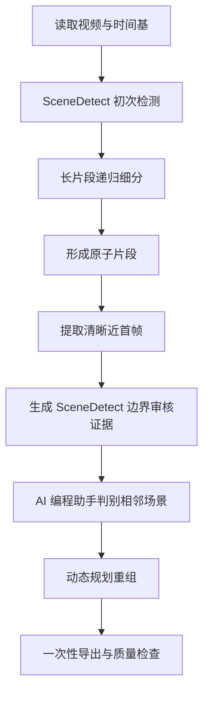

# TikTok 短视频复刻需求-001

## 第一阶段：视频片段切分、关键帧提取与片段重组

| 项目 | 内容 |
| --- | --- |
| 文档版本 | 003 |
| 文档状态 | 已按无模型方案澄清 |
| 当前范围 | 第一阶段 |
| 输入 | TikTok 商品展示类短视频 |
| 输出 | 生成片段、清晰近首帧、时间轴清单及质量检查结果 |

## 1. 背景

项目需要在现有能力上进行二次开发，增加 TikTok 商品短视频复刻工作流。完整工作流规划如下：

1. 对源视频进行片段切分和关键帧提取；
2. 针对关键帧进行新场景替换；
3. 针对新场景关键帧进行人物替换；
4. 对每个片段，使用“源视频片段 + 新关键帧”生成新视频片段；
5. 按原时间顺序组装新视频片段，并挂载或同步处理源音频，形成最终视频。

本需求先完成第一阶段，即视频片段切分、关键帧提取和片段重组。第一阶段必须保留视频片段、关键帧及源时间轴之间的绑定关系，供后续场景替换、人物替换、视频片段生成和源音频组装直接使用。

## 2. 建设目标

第一阶段需要实现以下能力：

1. 使用 PySceneDetect 识别镜头边界；
2. 对时长过长的片段递归细分，保证最终片段满足后续视频生成时长限制；
3. 为每个原子片段提取一张清晰、靠近片段起点的关键帧；
4. 对相邻短片段进行合理重组；
5. 输出视频片段、关键帧、源时间映射、重组关系和异常信息；
6. 保持源视频的镜头顺序、动作顺序和时间轴可追溯性。

## 3. 本期范围

### 3.1 包含范围

- 视频元数据与时间基读取；
- 场景边界检测；
- 长片段递归细分；
- 无自然切点时的强制切分；
- 清晰近首帧提取；
- 相邻短片段的 SceneDetect 边界证据生成与 Agent 场景关系判别；
- 基于全局约束的片段重组；
- 视频片段与关键帧一次性导出；
- 时间轴清单、删除区间和质量报告输出。

### 3.2 不包含范围

- 新场景设计与关键帧场景替换；
- 人物替换；
- 视频生成模型调用；
- 新视频片段质量评估；
- 最终视频拼接与音频合成。

本阶段只需要为后续音频处理提供准确的源时间区间及删除区间，不直接完成最终音频编辑。

## 4. 核心概念

### 4.1 原子片段 Atomic Segment

由 SceneDetect 自然切点或系统强制切点产生的最小连续视频区间。每个原子片段对应一张清晰近首帧。

### 4.2 生成片段 Generation Clip

后续交给视频生成模型的处理单元。一个生成片段由 1～3 个时间上连续的原子片段组成。

### 4.3 清晰近首帧 Clear Near-start Frame

位于原子片段起点附近、避开黑帧、模糊帧和转场帧的最早可用清晰画面。它不一定是解码得到的物理第一帧。

### 4.4 场景组 Scene Group

环境身份和空间关系相同或高度相似的一组相邻原子片段。不同机位、景别和裁切可以属于同一个场景组。

### 4.5 硬边界 Hard Boundary

不允许自动跨越重组的边界，包括明确的环境切换、黑场分隔、章节切换或其他已确认的语义边界。

## 5. 核心原则

1. **先操作时间轴，最后一次性导出文件。** 检测、递归细分和重组阶段只维护时间点，不重复切割和转码视频。
2. **只合并相邻片段。** 不允许从视频其他位置选择相似片段进行拼接，不改变原镜头顺序。
3. **时长严格约束。** 最终生成片段必须不少于 3.2 秒，并严格小于 15 秒。
4. **切点和关键帧可追踪。** 所有输出必须记录对应的源视频时间戳。
5. **短片段不静默丢弃。** 删除任何片段都必须满足规则并写入删除区间清单。
6. **关键帧不承担跨片段连续性。** 场景连续性由场景组和后续场景资产管理，不通过复用错误关键帧维持。

## 6. 总体流程



## 7. 功能需求

### FR-001 视频读取与元数据

系统应读取并记录：

- 视频总时长；
- 编码格式、分辨率和旋转信息；
- 平均帧率、实际时间基和是否为可变帧率；
- 音频轨道是否存在；
- 视频解码异常信息。

所有片段时长和切点应以 PTS/时间基为准，不得只通过“帧号 ÷ 标称帧率”计算，以兼容可变帧率视频。

### FR-002 初次场景检测

初次检测使用以下默认参数：

```bash
scenedetect -b pyav \
  -i <source_video> \
  detect-content \
  --threshold 50 \
  --min-scene-len 12 \
  list-scenes
```

要求：

1. 初始阈值为 50；
2. 最小场景长度为 12 帧；
3. 此步骤只获得场景边界，不执行 `split-video`；
4. 每个切点需要保存检测阈值、检测分数及源时间戳。

### FR-003 长片段递归细分

对时长大于或等于 15 秒的原子片段继续执行检测：

```text
45 → 40 → 35 → 30 → 25 → 20
```

要求：

1. 每轮阈值降低 5；
2. 每轮只处理仍然大于或等于 15 秒的片段；
3. 最低阈值默认设置为 20，且应支持配置；
4. 优先选择 SceneDetect 分数更高、位置更合理的切点；
5. 在存在多个候选切点时，优先使切分后的片段时长相对均衡；
6. 除非没有其他选择，候选切点应距离当前片段两端至少 3.2 秒；
7. 递归处理直到所有原子片段严格小于 15 秒。

### FR-004 无自然切点时强制切分

当阈值降低至最低值后，片段仍大于或等于 15 秒，系统必须强制插入切点。

强制切点选择规则：

1. 优先在距离当前片段起点 8～12 秒的范围内搜索；
2. 优先选择低运动、曝光正常且清晰的帧；
3. 避免选择黑场、白场、模糊帧或快速转场中间帧；
4. 强制切分的目标时长建议不超过 14.8 秒，为封装和浮点误差预留余量；
5. 强制切点必须标记 `boundary_type=forced`。

### FR-005 清晰近首帧提取

每个原子片段必须提取一张清晰近首帧。

默认搜索区间为：

```text
片段起点 ～ min（片段起点后 1 秒，片段长度的 30%）
```

候选帧评估至少包含：

- 清晰度；
- 黑帧、白帧及曝光异常比例；
- 与后续连续帧的稳定性；
- 距离片段起点的偏移量。

选择规则：

1. 优先选择最早达到质量门槛的候选帧；
2. 不应为了获得略高清晰度而选择距离片段起点过远的画面；
3. 若搜索区间内没有候选帧达到门槛，选择综合分数最高的帧；
4. 降级选择必须标记 `quality_status=low_quality_fallback`；
5. 必须保存关键帧的源时间戳和片段内偏移量。

每个原子片段的清晰近首帧是该原子片段后续场景分析与生图的唯一默认基准。

### FR-006 边界证据与 AI 助手判别

系统只处理相邻原子片段之间的边界，不在 Python 运行时加载 CLIP、Torch、Transformers 或其他视觉模型。

每个已采用的自然边界必须输出 SceneDetect `content_val`、HSV 变化分量、检测阈值和精确 PTS，并生成左右关键帧、边界前后上下文帧、边界两侧最近帧及中心遮罩背景视图。边界强度只表示相邻帧的像素变化，不得单独作为场景语义结论。

AI 编程助手查看证据后提交 `same_scene`、`different_scene` 或 `uncertain`。判断应优先依据背景身份、空间结构、光照和时间连续性，不得因商品或人物相同就认定同场景。未完成或不确定的判别禁止自动跨越；第二轮扩展上下文后仍不确定则进入人工检查。

### FR-007 片段重组

片段重组必须满足以下硬性条件：

1. 只能组合时间上连续的原子片段；
2. 不改变源视频中的镜头顺序；
3. 一个生成片段最多包含 3 个原子片段；
4. 生成片段时长必须大于或等于 3.2 秒；
5. 生成片段时长必须严格小于 15 秒；
6. 不主动合并两个时长均大于或等于 3.2 秒的原子片段；
7. 一个自动合并组合内最多存在一个时长大于或等于 3.2 秒的原子片段；
8. 不允许自动跨越硬边界。

在满足硬约束的候选方案中，按以下优先级选择：

1. 最小化丢弃时长；
2. 最小化无法满足 3.2 秒要求的片段数量；
3. 只跨越 Agent 或人工确认的同场景软边界；
4. 在其他条件相同时，优先跨越 SceneDetect 边界强度较低的软边界；
5. 尽量减少不必要的合并。

重组应使用动态规划或等价的全局优化算法，不应采用遇到短片段后立即向前或向后合并的局部贪心算法。

### FR-008 孤立短片段处理

#### 8.1 小于 1 秒的片段

处理优先级如下：

1. 尝试与同场景的相邻片段组合；
2. 重新规划前后生成片段组合；
3. 尝试在不跨硬边界的前提下调整相邻非硬切点；
4. 仍无法满足约束时，根据配置进入删除或人工检查流程。

默认配置应为：

```yaml
allow_drop_under_1s: false
```

只有显式开启删除配置后，系统才可以丢弃小于 1 秒的片段。删除后必须写入 `dropped_intervals`，供最终音频同步裁剪。

#### 8.2 大于或等于 1 秒且小于 3.2 秒的片段

此类片段不得自动丢弃。

处理优先级如下：

1. 使用全局重组算法重新组合；
2. 在同一场景组内调整非硬边界或从相邻长片段借用少量时长；
3. 若仍无法满足时长约束，标记 `needs_review`。

系统不得通过静默跨越明显不同场景或删除该片段来掩盖异常。

### FR-009 关键帧与生成片段绑定

生成片段必须保留其成员原子片段的清晰近首帧：

- 单原子片段生成片段：1 张关键帧；
- 两原子片段生成片段：2 张关键帧；
- 三原子片段生成片段：3 张关键帧。

第一张关键帧为生成片段的主起始关键帧，其他关键帧用于绑定内部镜头切换时刻。它们不得被解释成彼此独立、无连续关系的新场景。

### FR-010 一次性导出

完成场景检测、长片段细分和重组后，系统才从源视频一次性导出生成片段和关键帧。

要求：

1. 不使用递归生成的中间视频作为下一轮输入；
2. 避免多次转码导致画质损失和时间戳漂移；
3. 所有片段直接通过源视频起止时间导出；
4. 导出后重新测量实际时长；
5. 若实际时长达到或超过 15 秒，必须自动修正并重新导出；
6. 文件命名必须使用稳定 ID，不依赖可能重复的场景名称。

### FR-011 结果清单

系统至少输出以下清单：

```text
run/
├── manifests/
│   ├── video.json
│   ├── atomic_segments.json
│   ├── generation_clips.json
│   ├── dropped_intervals.json
│   └── quality_report.json
├── keyframes/
├── clips/
└── logs/
```

原子片段记录示例：

```json
{
  "segment_id": "S0005",
  "source_start": 8.4,
  "source_end": 10.1,
  "duration": 1.7,
  "detect_threshold": 40,
  "boundary_type": "scenedetect",
  "scene_group_id": "SG002",
  "keyframe": {
    "path": "keyframes/S0005_start.jpg",
    "source_timestamp": 8.58,
    "segment_offset": 0.18,
    "quality_status": "passed"
  }
}
```

生成片段记录示例：

```json
{
  "clip_id": "C0003",
  "source_start": 8.4,
  "source_end": 14.7,
  "duration": 6.3,
  "atomic_segments": ["S0005", "S0006"],
  "keyframes": [
    "keyframes/S0005_start.jpg",
    "keyframes/S0006_start.jpg"
  ],
  "status": "ready"
}
```

## 8. 动态规划重组设计

按源时间顺序排列全部原子片段。对于每个位置，枚举由后续 1～3 个连续原子片段构成的候选组合。

候选组合只有满足以下条件才能进入自动方案：

```text
原子片段数量 <= 3
3.2s <= 总时长 < 15s
时长 >= 3.2s 的成员数量 <= 1
不跨越硬边界
```

对完整时间轴进行全局求解，使用按优先级比较的代价向量：

```text
（删除总时长，异常片段数量，所跨软边界 content_val 总和，合并次数，确定性顺序）
```

前一项优先级高于后一项，避免因为边界较弱或被确认同场景而牺牲时间轴完整性。

## 9. 默认配置

```yaml
scene_detection:
  backend: pyav
  initial_threshold: 50
  threshold_step: 5
  minimum_threshold: 20
  min_scene_len_frames: 12

duration:
  min_generation_clip_s: 3.2
  max_generation_clip_s: 15.0
  max_duration_exclusive: true
  forced_split_target_max_s: 14.8

regroup:
  max_atomic_segments: 3
  allow_merge_two_normal_segments: false
  allow_cross_hard_boundary: false
  allow_drop_under_1s: false
  drop_threshold_s: 1.0

keyframe:
  search_window_s: 1.0
  search_window_ratio: 0.3
  prefer_earliest_passed_frame: true
```

清晰度和 SceneDetect 阈值应通过测试视频集标定。首版不设置模型相似度阈值。

## 10. 异常处理

| 异常 | 处理要求 |
| --- | --- |
| 视频无法解码 | 任务失败，输出明确错误，不生成部分成功结果 |
| 局部帧解码失败 | 跳过损坏帧并记录；影响连续时间区间时标记人工检查 |
| 长镜头无自然切点 | 使用稳定帧强制切分 |
| 起始搜索窗口均为低质量帧 | 选择最高分候选并标记降级 |
| 1～3.2 秒片段无法组合 | 不删除，标记 `needs_review` |
| 小于 1 秒片段无法组合 | 根据配置删除或标记人工检查 |
| 导出片段实测达到 15 秒 | 自动调整结束时间并重新导出 |
| 删除视频区间但未生成音频裁剪信息 | 任务判定失败 |
| 源视频总时长不足 3.2 秒 | 标记不满足自动处理条件 |

## 11. 验收标准

| 检查项 | 验收条件 |
| --- | --- |
| 时长上限 | 所有可用生成片段严格小于 15 秒 |
| 时长下限 | 所有可用生成片段大于或等于 3.2 秒 |
| 长片段处理 | 任意大于或等于 15 秒的输入区间均被自然或强制细分 |
| 合并数量 | 每个生成片段最多包含 3 个原子片段 |
| 正常片段保护 | 不自动合并两个均大于或等于 3.2 秒的原子片段 |
| 顺序正确性 | 只组合相邻片段，不重排，不跨位置拼接 |
| 时间轴完整性 | 除显式删除区间外，无时间空洞、重叠或重复 |
| 删除可追踪 | 所有删除区间均包含原因及源起止时间 |
| 关键帧质量 | 关键帧位于片段开头附近，并通过质量检查或明确标记降级 |
| 时间戳准确性 | 关键帧和片段均记录真实源时间戳 |
| 音频兼容性 | 可根据时间清单恢复原顺序或同步删除对应音频区间 |
| 可复现性 | 相同源视频、配置、工具版本和审核提交得到一致结果 |

## 12. 核心测试用例

| 原子片段时长与条件 | 预期结果 |
| --- | --- |
| `3.3s、4.1s` | 两个片段保持独立 |
| `1.4s、2.0s`，Agent 确认同场景 | 合并为 3.4 秒生成片段 |
| `2.0s、2.0s、2.0s、2.0s` | 全局规划为两个合法生成片段，不产生四片段组合 |
| 单镜头 31 秒，无检测切点 | 强制切成多个均小于 15 秒的原子片段 |
| `0.7s` 无可合并邻居，禁止删除 | 标记人工检查，不静默删除 |
| `0.7s` 无可合并邻居，允许删除 | 写入删除清单并生成音频同步裁剪区间 |
| `1.8s` 位于两个硬边界之间 | 不删除，不跨硬边界，标记人工检查 |
| 片段首帧为黑场，0.2 秒后清晰 | 选择后移的最早清晰帧，并记录真实偏移量 |
| 可变帧率视频 | 基于 PTS 计算边界和时长，结果无累计漂移 |

## 13. 建议模块划分

```text
VideoProbe
  读取视频元数据和时间基

SceneDetector
  执行初次 SceneDetect 检测

LongSegmentRefiner
  递归降低阈值并处理强制切点

ClearFrameSelector
  提取和评估清晰近首帧

BoundaryReviewBuilder
  输出 SceneDetect 指标、证据板与 Agent 审核请求

SegmentRegrouper
  使用动态规划形成生成片段

MediaExporter
  从源视频一次性导出片段和关键帧

ManifestWriter
  输出时间轴、映射关系和质量报告
```

## 14. 第一阶段完成定义

当系统能够对输入视频稳定产出以下内容时，第一阶段视为完成：

1. 满足时长约束的生成片段；
2. 每个原子片段对应的清晰近首帧；
3. 原子片段与生成片段的完整映射；
4. 每个输出对应的源时间戳；
5. 可供最终音频同步使用的删除区间；
6. 明确、可定位的异常和人工检查项；
7. 可直接被第二阶段“关键帧新场景替换”读取的标准化清单。

## 项目文档
- prd 文档：评估后的 prd 写到 ./docs-dev/prds 目录
- plan 文档：设计文档 写到 ./docs-dev/plans 目录
